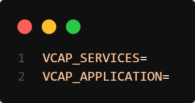

### About

The `NodeJS` application utilizes the Express framework to bootstrap the application. Express is a popular web application framework for Node.js that simplifies the development of server-side applications.

When XSUAA is enabled, the `NodeJS` application makes use of various `@sap` libraries to validate the `JWT` (JSON Web Tokens) tokens.

Additionally, `nodemon` is utilized for live application reload. Nodemon is a development tool that monitors changes to the application files and automatically restarts the server when any modifications are detected. This enables a smoother development experience as you can see the changes in real-time without having to manually restart the server after every code change.

By combining Express, XSUAA libraries, and nodemon, the NodeJS application provides a robust and efficient foundation for building secure and responsive server-side applications.


The project configuration may vary depending on whether `XSUAA` (SAP Cloud Foundry service for authorization and authentication) is enabled or not.

```bash
|---nodejs
|   |---src
|   |   |---middlewares
|   |   |---routes
|   |   |---types
|   |   |---app.ts
|   |   |---index.ts
|   |---.cfignore
|   |---.editorconfig
|   |---.eslintignore
|   |---.lintstagedrc.json
|   |---.prettierignore
|   |---.prettierrc.json
|   |---package.json
```

!!! note "If XSUAA is enabled"

    To ensure proper configuration of your frontend application, you will need to include a `.env` file in the `root` directory of the frontend project. This file should contain the necessary environment variables and configurations for `VCAP_SERVICES` and `VCAP_APPLICATION`.

Here is an example for the same:

{width="50%"}


### Usage Instructions

!!! note "If XSUAA is enabled"    

To check if the user is authorized, you can use the helper function `auth()`

```typescript
router.get('/', auth(), async (req: Request, res: Response) => {
    res.send('Hello World!');
});
```

To check if the user is authorized & has a role, you can use the helper function `auth('<role>)`

```typescript
router.get('/', auth("import,export"), async (req: Request, res: Response) => {
    res.send('Hello World!');
});
```


To start the application simply run:

NPM
```console
npm run dev
```

YARN
```console
yarn run dev
```

PNPM
```console
pnpm dev
```