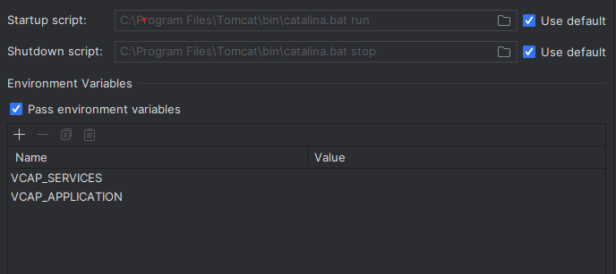

### About

The `Spring Boot` application utilizes `Maven` for efficient dependency management. It adheres to the `MVC` architecture for seamless application execution. Depending on whether `XSUAA` is selected or not, you may obtain a configuration bean file that handles protected resources effectively.


The project configuration may vary depending on whether `XSUAA` (SAP Cloud Foundry service for authorization and authentication) is enabled or not.

```bash
|---springboot
|   |---.mvn
|   |---src
|   |   |---main
|   |   |   |---java
|   |   |   |---resources
|   |   |---test
|   |---mvnw
|   |---mvnw.cmd
|   |---pom.xml
```

!!! note "If XSUAA is enabled"

    To ensure proper configuration of your spring boot application, you will need to include a enviourment variables in the project. It should contain the necessary environment and configurations for `VCAP_SERVICES` and `VCAP_APPLICATION`.

Here is an example for the same if you're using Intellij for running the application:




### Usage Instructions

!!! note "If XSUAA is enabled"    

To check if the user is authorized, you can use the `SecurityConfiguration.java` class to ensure per API level protection

```java
.requestMatchers("/api/v2/**").hasAuthority("SCOPE")
.requestMatchers("/api/**").authenticated()
```

To start the application simply run:

Maven
```console
mvn spring-boot:run
```

Java
```console
java -jar path/to/your/jarfile.jar <namespace>
```