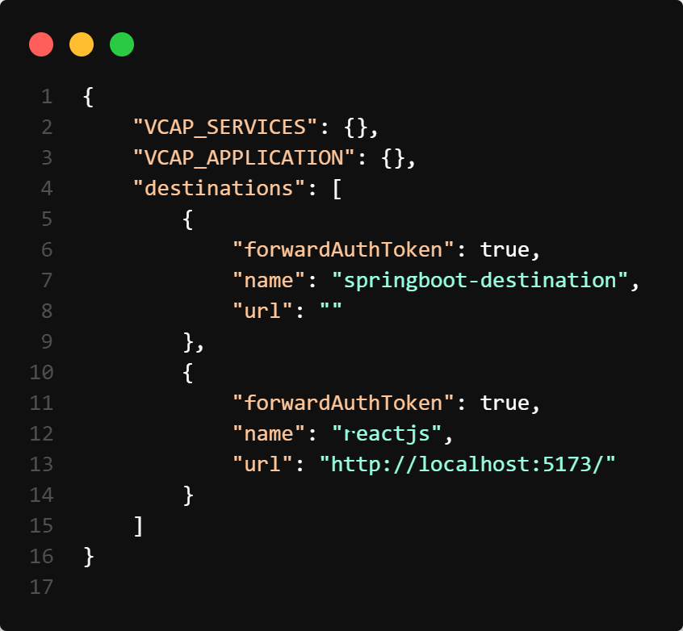

### About

The available `React` generated package offers the flexibility to create React-based components for your application. It leverages [Vite](https://vitejs.dev/) for tooling and bootstrapping, providing a fast and efficient development experience.

To enable access for XSUAA (SAP Cloud Foundry service for authorization and authentication), an embedded approuter is used. The approuter acts as a middleware component that handles authentication and authorization for protected resources.

In this setup, the frontend URL is configured as a destination to access protected resources. This means that the approuter will intercept requests to the frontend URL and validate the user's authentication status and permissions before allowing access to the protected resources.

By utilizing the embedded approuter and configuring the frontend URL as a destination, your application ensures secure access to protected resources while leveraging the React components and the benefits of the Vite framework.

The project configuration may vary depending on whether `XSUAA` (SAP Cloud Foundry service for authorization and authentication) is enabled or not.

```bash
|---react
|   |---approuter
|   |---deployer
|   |---public
|   |---src
|   |   |---assets
|   |   |---App.css
|   |   |---App.tsx
|   |   |---index.css
|   |   |---main.tsx
|   |   |---vite-env.d.ts
|   |---index.html
|   |---package.json
|   |---tsconfig.node.json
|   |---xs-app.json
```

!!! note "If XSUAA is enabled"

    To ensure proper configuration of your frontend application, you will need to include a `default-env.json` file in the `public` directory of the frontend project. This file should contain the necessary environment variables and configurations for `VCAP_SERVICES`, `VCAP_APPLICATION`, and `destinations`.

!!! note "If XSUAA is disabled"

    This file should contain only the `destinations` array


Here is an example for the same:

{width="70%"}

### Usage Instructions

!!! note "Destinations"

    The destination URL can either point to the `local server` of your backend or any of the `deployed` backend application. 
    
    In addition to the backend destination, a frontend destination should also be provided to ensure protected access of `react` application. The default URL for accessing the UI is [http://localhost:5000](http://localhost:5000/index.html)


To start the application simply run:

NPM
```console
npm run dev
```

YARN
```console
yarn run dev
```

PNPM
```console
pnpm dev
```