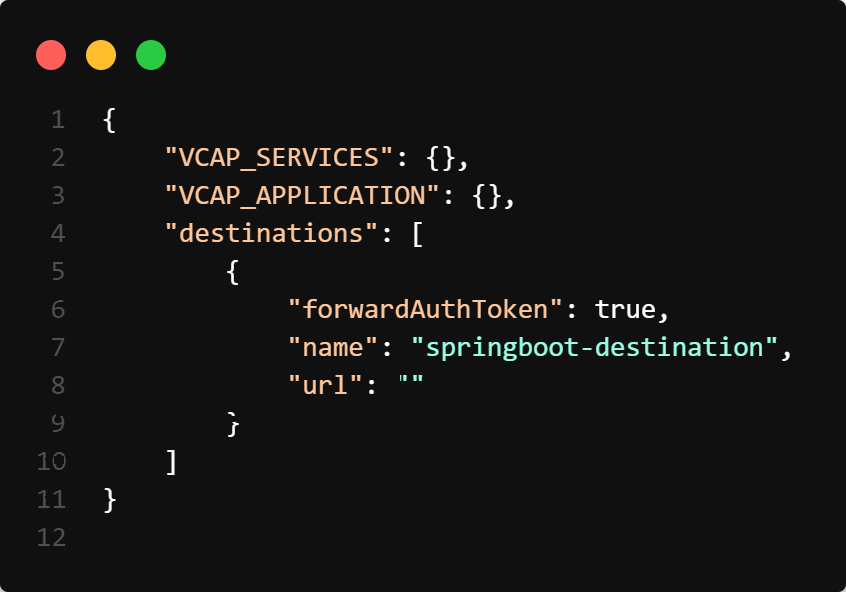

### About

The available `UI5` generated package provides the flexibility to create a freestyle UI5 application. You can leverage the wide range of [components](https://sapui5.hana.ondemand.com/) and features available within this package to build your UI5 application according to your specific requirements.

The project  configuration may vary depending on whether `XSUAA` (SAP Cloud Foundry service for authorization and authentication) is enabled or not.

```bash
|---ui5
|   |---approuter
|   |---deployer
|   |---webapp
|   |---.editorconfig
|   |---.eslintignore
|   |---.eslintrc
|   |---.gitignore
|   |---.prettierignore
|   |---.prettierrc
|   |---karma-ci.conf.js
|   |---karma.conf.js
|   |---package.json
|   |---tsconfig.json
|   |---ui5.yaml
|   |---xs-app.json
```

!!! note "If XSUAA is enabled"

    To ensure proper configuration of your frontend application, you will need to include a `default-env.json` file in the `root` directory of the frontend project. This file should contain the necessary environment variables and configurations for `VCAP_SERVICES`, `VCAP_APPLICATION`, and `destinations`.

!!! note "If XSUAA is disabled"

    This file should contain only the `destinations` array

Here is an example for the same:

{width="80%"}

### Usage Instructions

!!! note "Destinations"

    The destination URL can either point to the `local server` of your backend or any of the `deployed` backend application. The default URL for accessing the UI is [http://localhost:5000](http://localhost:5000/index.html)


To start the application simply run:

NPM
```console
npm run dev
```

YARN
```console
yarn run dev
```

PNPM
```console
pnpm dev
```