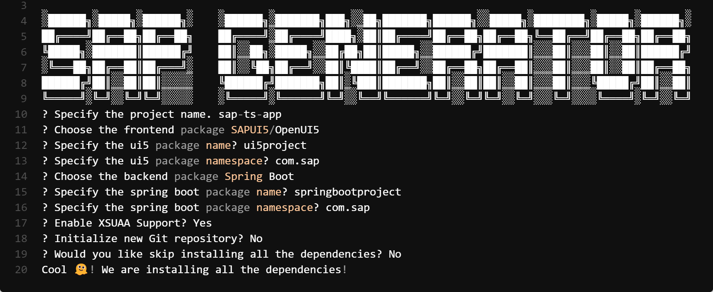

## Getting Started

We offer the ability to `scaffold` your application using the `command-line interface` (CLI). This provides an alternative method for quickly generating the app's structure and code.

By utilizing the `CLI`, you can execute specific commands to initiate the scaffolding process. This allows for greater flexibility and automation, making it ideal for integrating with build scripts or incorporating into your development workflows.

The CLI provides a set of commands and options that enable you to specify the desired app features, select templates, and configure various settings. This way, you can customize the scaffolding process according to your specific requirements.

Whether you prefer the convenience of a graphical user interface or the flexibility of the CLI, we offer multiple options to scaffold your app efficiently and effectively. Choose the method that best suits your needs and start building your application with ease.

### Usage Instructions

To use the generator, simple run:

NPM
```console
npm create @ragarwal06/sap-fs-app@latest
```

YARN
```console
yarn create @ragarwal06/sap-fs-app@latest
```

!!! bug "Compatibility Issues with yarn >1.2x"

    Please note that there have been reported issues with the SAP Cloud Application Generator when using recent versions of the Yarn package manager. If you encounter any problems while using the generator, we recommend trying alternative package managers such as npm or pnpm.


PNPM
```console
pnpm create @ragarwal06/sap-fs-app@latest
```



This will generate the app in you current workspace. You can directly start using the app. 🫡
