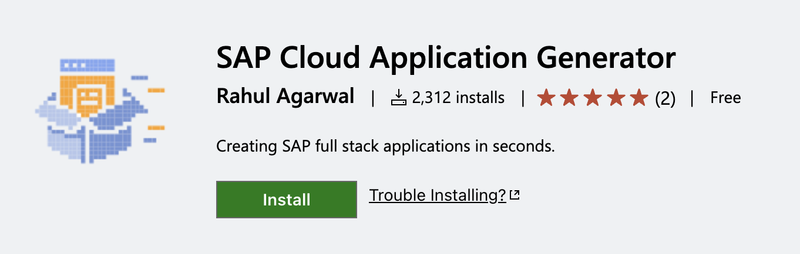
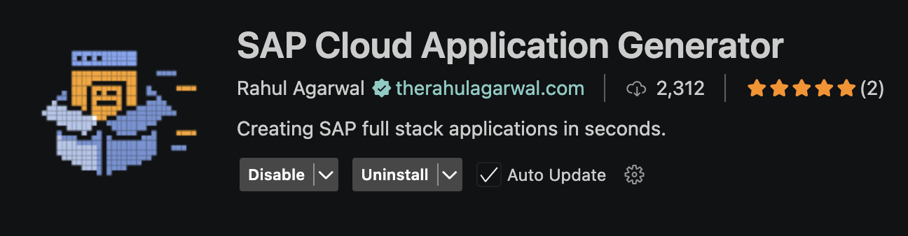
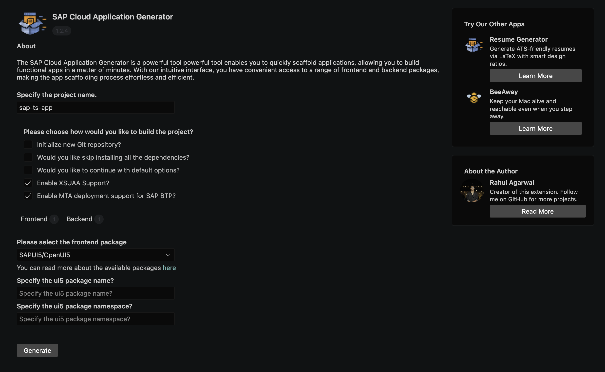

## Getting Started

We are committed to providing users with easy access to the `SAP Cloud Application Generator`. To cater to different preferences and workflows, we offer multiple options for interacting with the generator

For developers who prefer working within the [Visual Studio Code (VSCode)](https://code.visualstudio.com/) environment, we offer an extension specifically designed to integrate the `SAP Cloud Application Generator` seamlessly. By installing and utilizing the extension, you can access the generator's functionality directly within the `VSCode` editor, enhancing your development experience.

### Download

!!! example "Information"

    To download the `SAP Cloud Application Generator` extension, you can conveniently `download` the `extension` from the `marketplace` using this [link](https://marketplace.visualstudio.com/items?itemName=ragarwal06.create-sap-fs-app-vsix&ssr=false#overview). 

Once the below webpage opens.

Simply click on the `Download` button. This action will redirect you to the extension homepage within the `Visual Studio Code (VSCode) environment`. From there, click on the `Install` button to initiate the installation process.

Alternatively, you can directly access the `extension manager` within your IDE. Open the IDE and navigate to the `Extensions` view by clicking on the square icon on the left sidebar or using the shortcut `Ctrl+Shift+X`. In the search bar, enter `SAP Cloud Application Generator` and locate the extension in the search results. Click on the `Install` button to download and install the extension.

### Usage Instructions

1. Open the command palette (`Ctrl+Shift+P` on Windows and Linux, `Cmd+Shift+P` on OS X) and search for `SAP Cloud Applications: Generate`.
2. Enter the required details.
3. Adjust the packages if desired.
4. Click the `Generate` button to scaffold the app.

{width="80%"}

This will generate the app in you current workspace. You can directly start using the app. 🫡