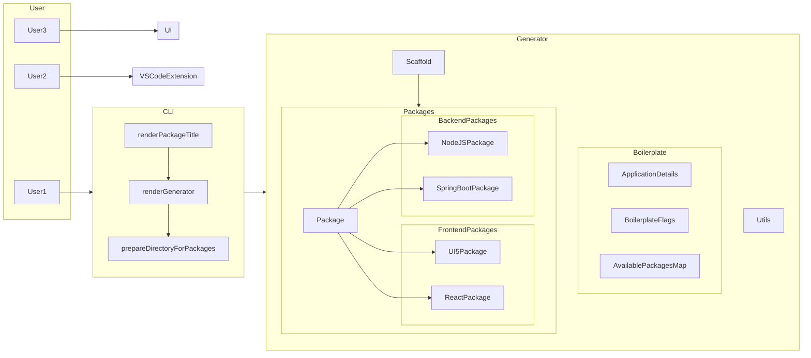

```mermaid
flowchart LR
  subgraph User
    User1
    User2
    User3
  end
  subgraph CLI
    direction TB
    renderPackageTitle --> renderGenerator --> prepareDirectoryForPackages
  end
  subgraph VSCodeExtension
  end
  subgraph UI
  end
  subgraph Generator
    direction TB
    subgraph Boilerplate
    direction LR
        ApplicationDetails
        BoilerplateFlags
        AvailablePackagesMap
    end
    subgraph Packages
        direction LR
          subgraph FrontendPackages
          direction TB
              UI5Package
              ReactPackage
          end
          subgraph BackendPackages
          direction TB
              NodeJSPackage
              SpringBootPackage
          end
        Package --> UI5Package
        Package --> ReactPackage
        Package --> NodeJSPackage
        Package --> SpringBootPackage
    end
    Scaffold
    Utils
    Scaffold --> Packages
    click Package "https://github.tools.sap/SAP-Cloud-Application-Generator/boilerplate-generator/blob/main/src/installers/frontend/ui5-installer.ts"
    click UI5Package "https://github.tools.sap/SAP-Cloud-Application-Generator/boilerplate-generator/blob/main/src/installers/frontend/ui5-installer.ts"
    click ReactPackage "https://github.tools.sap/SAP-Cloud-Application-Generator/boilerplate-generator/blob/main/src/installers/frontend/react-installer.ts"
    click NodeJSPackage "https://github.tools.sap/SAP-Cloud-Application-Generator/boilerplate-generator/blob/main/src/installers/backend/nodejs-installer.ts"
    click SpringBootPackage "https://github.tools.sap/SAP-Cloud-Application-Generator/boilerplate-generator/blob/main/src/installers/base-installer.ts"
    click BoilerplateFlags "https://github.tools.sap/SAP-Cloud-Application-Generator/boilerplate-generator/blob/main/src/boilerplate/boilterplater-struct.ts#L6"
    click AvailablePackagesMap "https://github.tools.sap/SAP-Cloud-Application-Generator/boilerplate-generator/blob/main/src/utils/packages/packages.ts#L33"
    click Scaffold "https://github.tools.sap/SAP-Cloud-Application-Generator/boilerplate-generator/blob/main/src/scaffold/scaffold.ts"
    click Utils "https://github.tools.sap/SAP-Cloud-Application-Generator/boilerplate-generator/tree/main/src/utils"
  end
  User1 --> CLI
  User2 --> VSCodeExtension
  User3 --> UI
  CLI --> Generator
```
