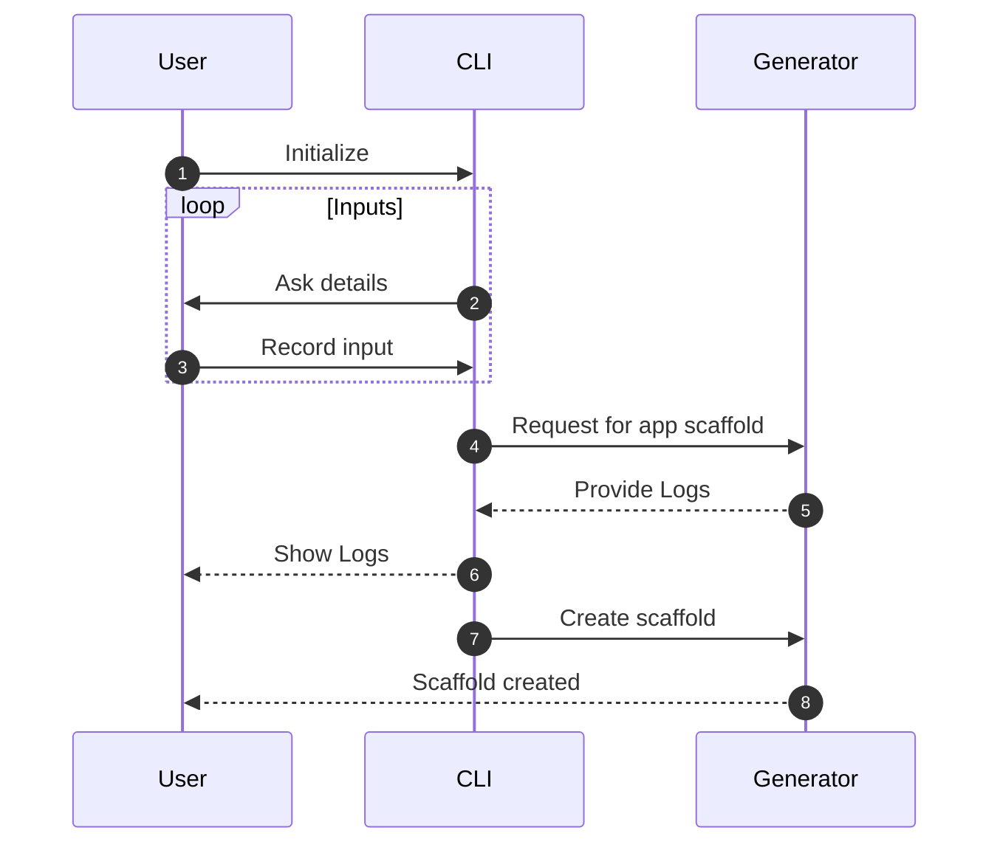

```mermaid
sequenceDiagram
  autonumber
  User->>CLI: Initialize
  loop Inputs
      CLI->>User: Ask details
      User->>CLI: Record input
  end
  CLI->>Generator: Request for app scaffold
  Generator-->>CLI: Provide Logs
  CLI-->>User: Show Logs
  CLI->>Generator: Create scaffold
  Generator-->>User: Scaffold created
```
