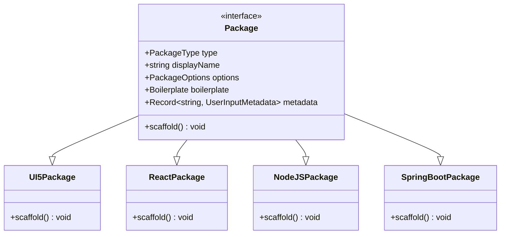

```mermaid
classDiagram
  class Package
  <<interface>> Package
  Package : +PackageType type
  Package : +string displayName
  Package : +PackageOptions options
  Package : +Boilerplate boilerplate
  Package : +Record~string, UserInputMetadata~ metadata
  Package : +scaffold() void
  
  class UI5Package
  UI5Package : +scaffold() void
  
  class ReactPackage
  ReactPackage : +scaffold() void
  
  class NodeJSPackage
  NodeJSPackage : +scaffold() void
  
  class SpringBootPackage
  SpringBootPackage : +scaffold() void

  Package --|> UI5Package
  Package --|> ReactPackage
  Package --|> NodeJSPackage
  Package --|> SpringBootPackage
```
