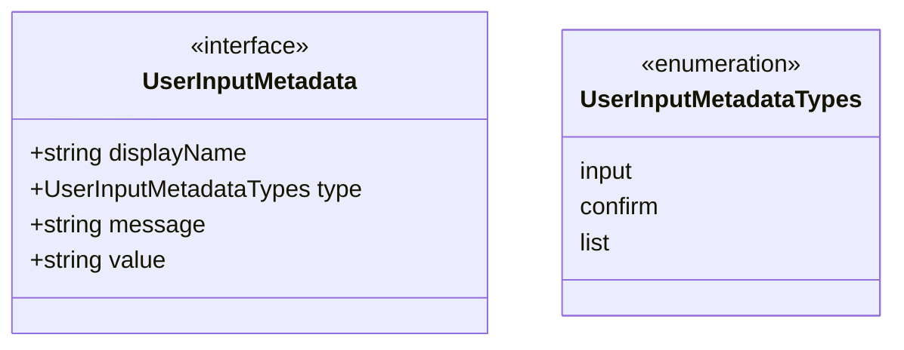

```mermaid
classDiagram
  class UserInputMetadata
  <<interface>> UserInputMetadata
  UserInputMetadata : +string displayName
  UserInputMetadata : +UserInputMetadataTypes type
  UserInputMetadata : +string message
  UserInputMetadata : +string value
  class UserInputMetadataTypes{
    <<enumeration>>
    input
    confirm
    list
  }
```
