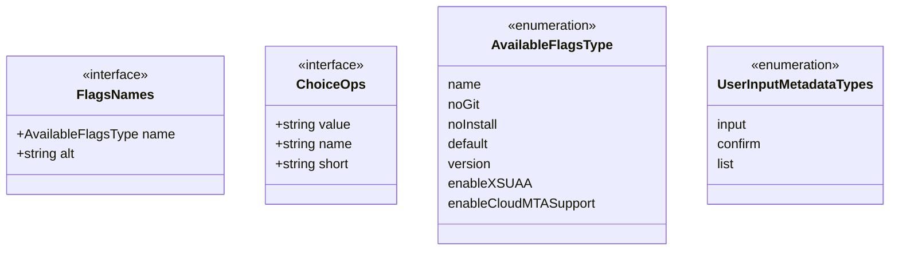

```mermaid
classDiagram
  class FlagsNames
  <<interface>> FlagsNames
  FlagsNames : +AvailableFlagsType name
  FlagsNames : +string alt
  class ChoiceOps
    <<interface>> ChoiceOps
    ChoiceOps : +string value
    ChoiceOps : +string name
    ChoiceOps : +string short
  class AvailableFlagsType{
    <<enumeration>>
    name
    noGit
    noInstall
    default
    version
    enableXSUAA
    enableCloudMTASupport
  }
class UserInputMetadataTypes{
    <<enumeration>>
    input
    confirm
    list
  }
```
