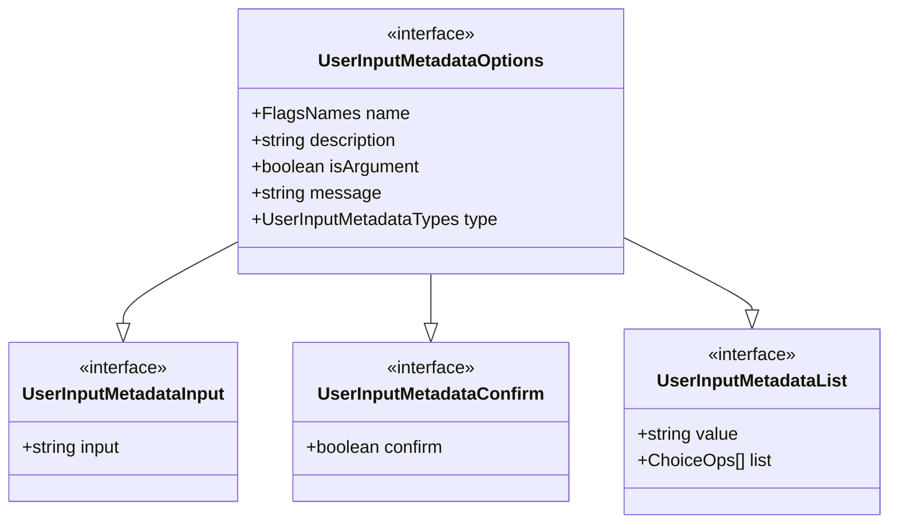

```mermaid
classDiagram
  class UserInputMetadataOptions
  <<interface>> UserInputMetadataOptions
  UserInputMetadataOptions : +FlagsNames name
  UserInputMetadataOptions : +string description
  UserInputMetadataOptions : +boolean isArgument
  UserInputMetadataOptions : +string message
  UserInputMetadataOptions : +UserInputMetadataTypes type
  class UserInputMetadataInput
  <<interface>> UserInputMetadataInput
  UserInputMetadataInput : +string input
  class UserInputMetadataConfirm
  <<interface>> UserInputMetadataConfirm
  UserInputMetadataConfirm : +boolean confirm
  class UserInputMetadataList
  <<interface>> UserInputMetadataList
  UserInputMetadataList : +string value
  UserInputMetadataList : +ChoiceOps[] list
  UserInputMetadataOptions --|> UserInputMetadataInput
  UserInputMetadataOptions --|> UserInputMetadataConfirm
  UserInputMetadataOptions --|> UserInputMetadataList
```
