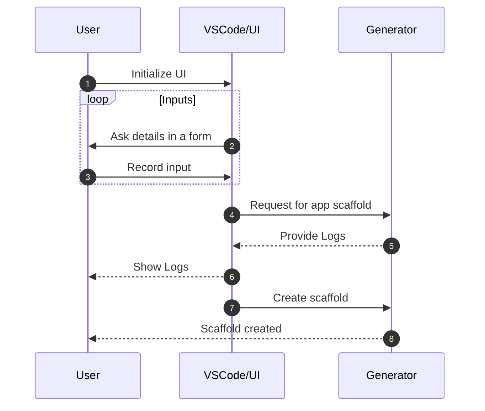

```mermaid
sequenceDiagram
  autonumber
  User->>VSCode/UI: Initialize UI
  loop Inputs
      VSCode/UI->>User: Ask details in a form
      User->>VSCode/UI: Record input
  end
  VSCode/UI->>Generator: Request for app scaffold
  Generator-->>VSCode/UI: Provide Logs
  VSCode/UI-->>User: Show Logs
  VSCode/UI->>Generator: Create scaffold
  Generator-->>User: Scaffold created
```
